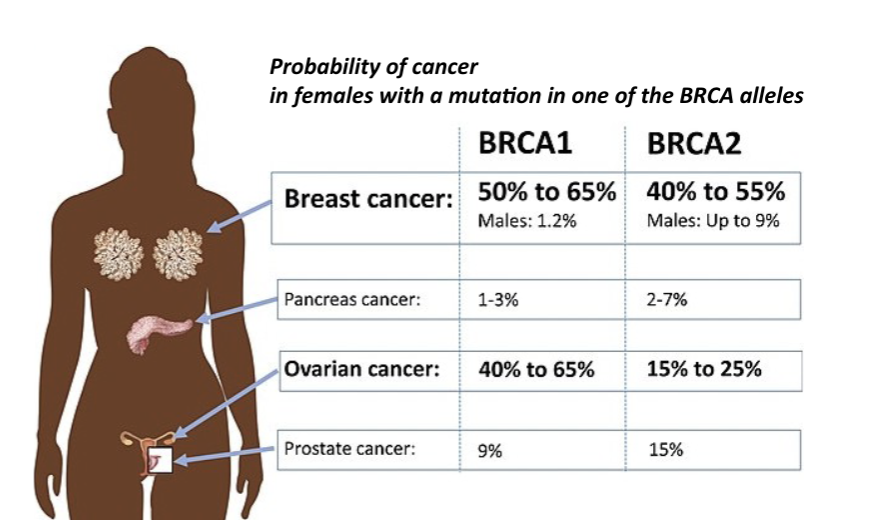

# BIO2B: Genetics and Evolution - DNA damage and repair
### Sveta Makolets

* Mutation is a 2 step process
* Lesion -> Incorrectly fixed lesion
* Once the lesion is fixed incorrectly the mutation is acquired

The probability that the mismatch is generated is 10e-8, and the probability of it escaping correct repair is 10e-2, so the probability of a mutation in a specific base pair is 10e-10.

Somatic mosaicism is a condition in which an individual's cells are not genetically identical due to mutations after fertilization.

Carcinogenesis: process of which normal cells turn into cancer cells

### Mutation Positive Feedback Loop
Part A (acquiring lesions):
1. DNA polymerase loses proofreading ability
2. Nucleotide synthesis is insufficient, wrong nucleotides incorporated more often
3. Replication axillary helicase loses function, forks break more often
4. Leaky mitochondria -> more ROS (reactive oxygen species) -> more oxidising of DNA

Part B (escaping correct repair):
1. Mutation in most DNA repair genes lead to higher mutation rates due to incorrect repair
2. Mutation in DNA damage checkpoint genes
3. Mutations in the chromosome segregation genes (e.g mitotic spindle)

Exposure to UV, smoking, toxins, and alcohol also increase the chance of DNA lesions and therefore mutations.

## Genes and cancer
BRCA1 and BRCA2 are commonly mutated in cancer.

Once a BRCA gene mutates, it's either repaired correctly or completely ignored, which then it'll become cancer eventually.

