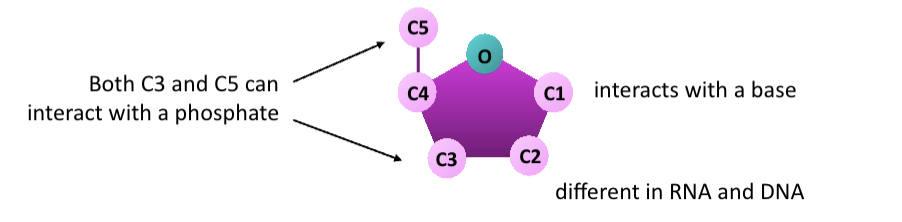
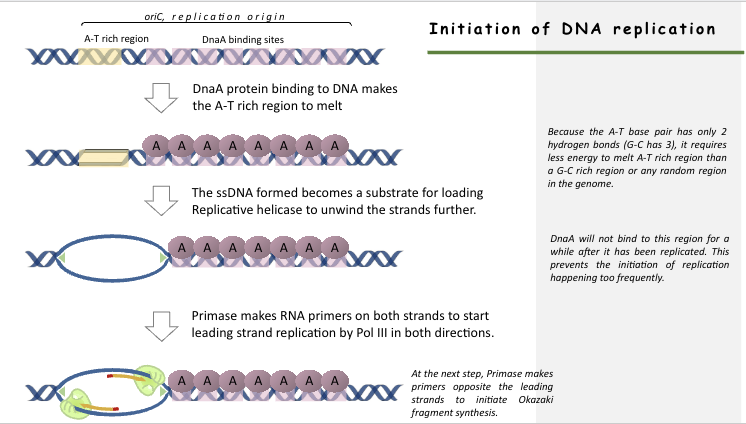

# BIO2B: Genetics and Evolution - DNA replication
### Sveta Makolets

## Nucleic acids
Nucleic acids are biopolymers.

PagPyct

The "primes" in DNA refer to the positions of the carbon atoms in the deoxyribose sugar ring that forms part of the backbone of the DNA molecule.

So 5' would be the fifth carbon in ribose, the one used in the phosphodiester backbone.

DNA polymerase adds stuff to the phosphodiester backbone.

## How DNA is replicated
Semi-conservative replication

DNA polymerase is smart and can remove wrong nucleotides.

Mechanical stress is generated due to the helical nature of DNA, and creates  supercoils (unwinding something at the front produces opposite winding on the other side, which need to be unwound through topoisomerases.

In DNA synthesis, one DNA polymerase works same direction as helicase whereas the other works in the opposite direction, and forms **okazaki fragments** rather than a single strand.

**Primase** lays RNA primers behind the helicase for the DNA polymerase to bind to an work.

(DNA polymerase can only start on 5' and end on 3')

DNA Pol. 1 removes the primer afterwards and ligase bridges the fragments together.

|Enzymes|Specific function|
|-|-|
|DNA pol 1|Exonuclease activity, removes RNA primer and replaces with newly synthesized DNA|
|DNA pol 3 (polymerase)|Main enzyme that adds nucleotides in 5'->3' direction|
|Helicase|Breaks H-bonds between adjacent bases|
|Ligase|Joins Okazaki fragments together|
|Primase|Synthesizes RNA primers for replication|
|Sliding clamp|Helps hold DNA polymerase in place when nucleotides are added|
|Topoisomerase|Relieves stress when unwinding by causing breaks, reseals DNA|
|Single-strand binding proteins|Binds to single-stranded DNA to prevent it winding back|
|Pol alpha| Extends the length of RNA primer; only in eukaryotes|
|Pol delta| Fills gaps left by primer|

## Prokaryotic genome
Bacterial DNA is contained in a circle chromosome and plasmids.

Replication starts at the origin and proceeds in both directions around the circle, until it terminates on the side of origin.

Replication is not coordinated with cell division. Bacteria will give itself more chromosomes, and divide when they feel like it.

## Initiation of DNA replication
(for E.coli)
In the replication origin, known as the oriC, there are DNA binding sites and a A-T rich region.
1. DnaA proteins bind onto DNA binding sites, makes A-T region melt
2. A-T region opens up a hole where helicase can start engaging and polymerase and primase can do their thing.

Replicon: DNA replicated from a single origin

## Telomeres structure and function
* Ends of linear eukaryotic chromosomes
* Consists of non-coding DNA, which is highly repetitive and G-C rich. All vertebrae have TTAGGG sequence
* Shelterin binds to telomeres to prevent degradation and forms a protective protein cap at the chromosome ends.
* 3' end is longer than the 5' end in humans

Telomerase: the enzyme responsible for extending telomeres due to DNA loss in conventional replication.
* Reverse transcriptase: converts RNA into DNA

