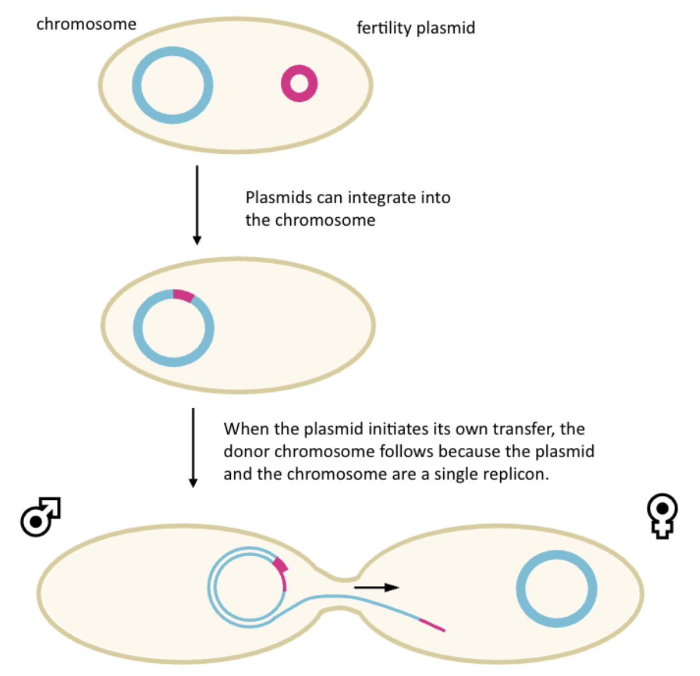
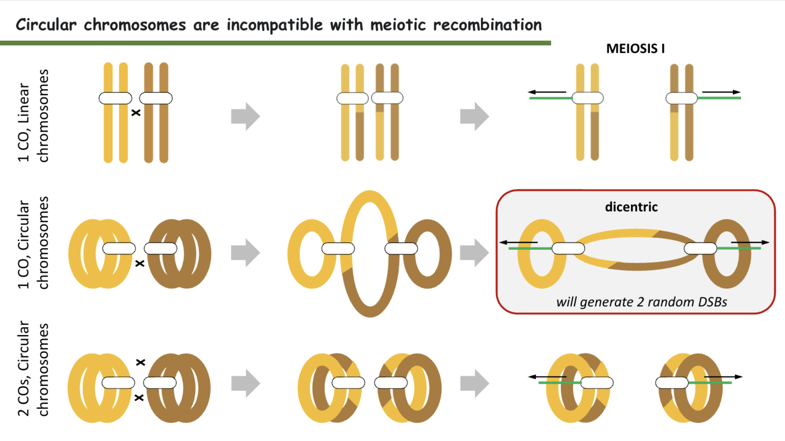

# BIO2B: Genetics and Evolution
### Sveta Makovets

## Stalled/Broken Replication Forks
Replication through a ssDNA break (nick or gap) results in a broken replication fork

![Replication Fork])(replicationfork.png)

The repair of broken forks operates via homologous recombination:
1. Broken end is recognized as DSB, Rad51 filament formed on 3' end
2. Broken end invades unbroken sister chromatid
3. RF is re-established but the two sister chromatids are joined by a nicked Holiday junction
4. Nicked HJ resolved by resolvases
5. Ligated

Recombinases are conserved from bacteria to humans.

## Bacterial Mating
Pilius extends into another cell, half the fertility plasmid is transferred into another one and they both replicate it so it becomes double stranded again.

Only Donors with the fertility plasmid have pili.

They can also do this:

### Why circular chromosomes are incompatible with meiotic recombination

