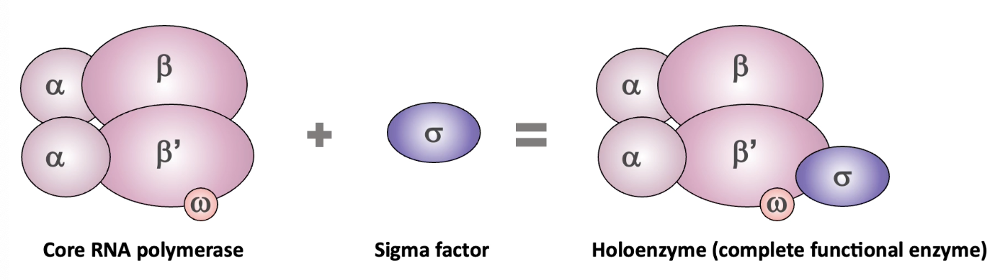
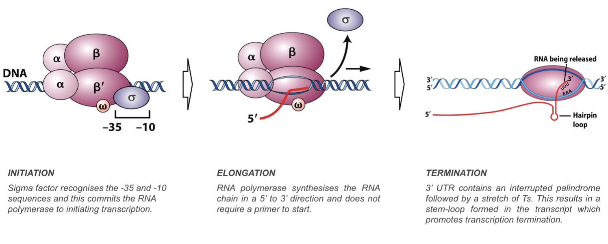

# Biology 2B: Genetics - Notes to catch up
## I feel like I can't help but always be so blue

### DNA Supercoiling
* Coiling of a coil
* Topological property of DNA
* Can be positive (same direction as helix) or negative (opposite direction)
* Negative favours unwinding, so DNA is usually like that
* Local unwinding needed for DNA replication, transcription, and recombination.

## Chromatin
Nucleosomes = DNA wrapped around histones. Nucleosomes are then wrapped around H1 histones.

Euchromatin: The least condensed part of chromatin, most rich in genes.
Heterochromatin: The most condensed part of chromatin, contains non-coding DNA and very few genes.

Exons = coding; Introns = non-coding

NEW EVIDENCE SUGGESTS that chromosomes are located in specific areas during interphase called 'chromosome territories'. Different chromosomes have different territories.

Genome: the complete set of genetic material in a cell

## Comparative genomics
Comparing the organization of the human genome with ones of other species can be used to show the evolutionary relationship.

The genome of two species can be arranged into blocks where the order of genes is the same as the MRA. This is called *synteny*. 
(similar areas are called areas of synteny)

||Prokaryotes|Eukaryotes|
|-|-|-|
|DNA level|Supercoiling|Nucleosomes/Chromatin|
|Gene level|Operon/Single promoter for several genes|Exons & introns/Individual promoters|
|Chromosome level|Mostly circular/One copy of each gene/Nucleoids|Linear, paired/Two copies of each gene/Membrane bound nucleus|
|Genome level|Most encodes proteins|1% encodes proteins/>98% non-coding/Comparative genomics can be used.|

## Regulation of gene expression in prokaryotes

The Central Dogma of Molecular Biology: genetic information can be transferred from DNA -> RNA -> protein/nucleic acid but cannot go the other way.

Coupled transcription occurs in prokaryotes due to their lack of nuclei so ribosomes can translate mRNA while they're being transcribed.

## Transcription
Monocistrionic: mRNA that encodes a single protein product
Polycistronic: mRNA that encodes multiple proteins; contains the genes for multiple products

Eukaryotes vs Prokaryotes:
1. Transcription and translation are uncoupled in eukaryotes
2. mRNA undergoes processing: 5'end capping, polydenylation, and splicing
3. Eukaryotic mRNAs are generally monocistronic

5'end Capping: the process of adding a modified G nucleotide of the pre-RNA molecule, which a) protects the mRNA from degradation b) involved in export of mature mRNA from the nucleus and c) helps initiate protein synthesis by binding to ribosomes.

Polydenylation: the addition of a long chain of adenine nucleotides (called a poly(A) tail) to the 3'end of the mRNA molecule. It enhances the stability of the mRNA, aids in its transport from the nucleus to the cytoplasm, and appears to have a role in initiating protein synthesis.

### Genes encoding proteins
Promoter: sequence upstream of gene/before start codon
Terminator: sequence downstream of gene/after stop codon

RNA Polymerase will recognize lengths of the promoter sequence, and there are two important stretches of DNA in this region:
1. Sequence at the position -10 - TATA box (due to the TATA sequence of RNA)
2. Sequence at the position -35

These two sequences help RNA polymerase know where to begin transcription.

### Operons
Operons are only found in prokaryotes.
They are mRNA that encode for more than one gene, and multiple genes are transcribed from the same promoter region.

RNA Polymerase in prokaryotes is a single enzyme transcribed in all genes. (Unlike eukaryotes which have three)

Prokaryotic RNA polymerase consists of 5 subunits in the core enzyme (beta, beta prime, 2 alphas, omega) and a sigma factor.
Sigma factor: a protein needed for initiation of transcription in bacteria.



RNA Polymerase action:


## Protein concentrations
Cells need different proteins in different amounts.

In bacteria, how much of a protein is controlled by a differential expression of a gene at the level of transcription.
What that means is that some genes are transcribed more than other genes.

Unoccupied promoters + RNA polymerase <=> RNA pol. bound to promoter
It is at equilibrium.

In a strong promoter situation the equilibrium is shifted to the right, and in a weak promoter situation the equilibrium will be shifted to the left. 
The amount of polymerase-bound promoter determines the amount of protein synthesized.

## Promoter strength comparison
The strength of a promoter can be measured using reporter genes (e.g GFP)

Stronger promoter -> more GP mRNA -> more GP protein -> stronger glow

The lacZ gene (beta galactosidase) can also be used and the amount of coloured product made can be used to quantize activity.

## Gene regulation
The regulation of gene expression is directed towards the final product, the protein.

Ways to affect protein production:
1. Transcriptional level - more transcription, more protein
2. Posttranscriptional level - more stable RNA transcripts
3. Translational level - premature termination, less protein
4. Posttranslational level - prtotein degradation, activation/deactivation of protein by adding groups to it (phosphate, acetyl, sumo, ubiquitin, etc)

Sigma factors are like Arceus's plates; you switch them out for different effects on the RNA polymerase and different genes are activated - *sigma factors recognize specific -35 and -10 sequences*

The genes that are recognized by specific sigma factors are scattered throughout the genome but are grouped together as a *regulon*

Regulon: group of specific genes that are activated by a certain sigma factor (e.g sigma H activates this group, H regulon and so so). Regulons are mutually exclusive sets.

## Positive and negative gene regulation
### Negative regulation:
The default state of the gene is on, so transcription occurs normally. 
However, when a repressor is released, the RNA polymerase can no longer bind onto the promoter and transcription halts.

### Positive regulation:
RNA polymerase has a weak natural binding to the promoter.
The activator binds to the *activator binding site* and physically helps RNA polymerase to bind to the promoter region, which then allows transcription to occur.


### Lac operon
Operon: transcriptional unit with more than one gene.

The lac operon has 3 - lacZ, lacY, and lacA
They code for beta-galactosidase, permease, and transacetylase, which are used for lactose breakage, lactose transport, and (unknown). 

The lac operon is regulated by LacI (lac repressor), which binds to the operator and prevents RNA polymerase binding to promoter. 

A product of lactose is needed for the repressor to unbind, which means that lactase will only be made in the process of lactose.

Transcription can be accelerated through the CAP  (catabolite activator protein) but requires cyclic AMP to bind to DNA. 

```
    Adenylyl Cyclase
ATP -------------> cAMP
	  T	
       Glucose
```

cAMP production is catalyzed by adenylyl cyclase but is inhibited by glucose.

### Allosteric regulation of proteins
Allosteric regulation: the regulation of an enzyme or protein's activity by the binding of an effector molecule at somewhere that's not the active site.

Both CAP and LacI are regulated by small molecules
