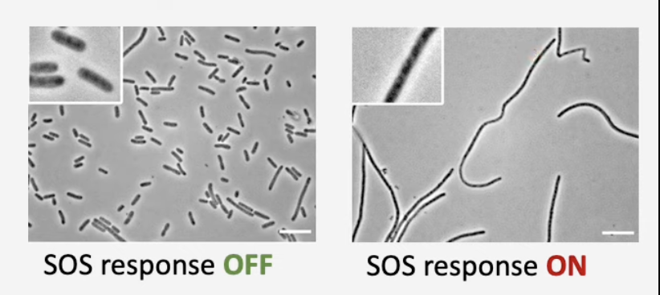

# BIO2B: Genetics and Evolution
### When I keep you up sending mamegoma lines

## DNA Damage and Repair
### DNA damage and its sources
Types of DNA lesions:
1. Single strand break - phosphodiester bond breaks on one part of the sugar-phosphate backbone
2. Double strand break - same deal, another strand
3. Bulky adduct - covalent bonding of carcinogenic aromatic compounds to DNA
4. Interstrand crosslink - nucleotides hydrogen bonding across different parts of the strand (like the 3rd and 5th rungs of a ladder being connected instead of 33 and 55)
5. Base mismatch - A&G, C&T
Base alkylation - alkylation of a base

Sources of damage:
1. UV light- thymine dimers break
2. Ionising radiation - ss and dsDNA breaks
3. Alcohol - interstrand crosslinks
4. Oxidative damage - oxidised bases from oxygen leaking past the bilayer of the mitochondria
5. Mechanical stress - dsDNA breaks

The largest source of a lesion is DNA replication: 
1. DNA is unpacked so it's more exposed to the elements
2. Mistakes may be uncorrected by DNA polymerase
3. Unpaired bases are exposed to reactive molecules

DNA lesions don't equate to mutations as they can be repaired and returned into original DNA.

Mutation - genetic change in DNA

Mutant - an organism carrying a mutation

### Repair of DNA lesions
Cut and patch: A small section of DNA (1-100 nucleotides) is cut out to remove structural damage, then filled back in via DNA polymerase.

Photolyase: light-activated enzyme that cleaves the thymine dimer bond

DSBs (Double strand breaks) and ICLs (Interstrand crosslinks):

Caused by:
|DSBs|ICLs|
|-|-|
|Broken replication forks|Endogenous metabolites (acetaldehyde/intermediate from alcohol metabolism)|
|Unseparated sister chromatids in mitosis|Specific chemicals (chemo)|
|Ionising radiation||
|Chemo drugs||

### DSB Repair (2 Pathways):
**Ligation of broken ends** - Error prone, causes small insertions and deletions near the site of repair
**Homologous recombination** - Requires homologous chromosome as template, and section will be copied from the unbroken DNA

**Erroneous repair**:
1. Telomere added to break - the other end will be lost, causing a terminal deletion in the chromosome as it doesn't have a centromere to segregate this properly
2. Reciprocal translocation - 2 pieces of chromosomes break at same time, but segments are swapped instead
3. Break ligated into wrong chromosome - either forms a dicentric chromosome (very unstable) or arm is ligated onto another chromosome

Gross chromosomal rearrangements: 
1. Large deletions
2. Large inversions
3. Large insertions
4. Translocations

All can arise from erroneous DSB repair, and are common in cancer cells.

### ICL Repair and cancer connections
* Not dangerous to cells unless they're replicating
* Replication cannot be done if the two strands can't be unzipped

## DNA damage response in bacteria
### SOS Response:
* Triggered by extensive DNA damage, usually replication errors or double stranded breaks
* Excess ssDNA from DNA ends being degraded (see exonuclease) is detected and triggers the response

SOS response is a transcription response that leads to activation of a set of genes for DNA repair and preventing cell division.

So bacteria become long and becomes filamentous as a result.

Response genes:
1. Cell division inhibition (replication continues) -> filamentous cells
2. Homologous recombination genes -> repair
3. Translesion synthesis DNA polymerase genes -> mutagenesis 

Translesion: Allows replication past site of damage Mutagenesis: DNA is changes

## DNA damage checkpoints in eukaryotes
1. G1 Checkpoint: If there are DSBs, entry into S phase is blocked
2. Intra-S Checkpoint: If there are problem replication forks in early S then late origins aren't fired
3. G2 Checkpoint: If there's ssDNA in G2, entry into mitosis is blocked

### G2 in yeast
1. Mec1 kinase binds to ssDNA and phosphorylates Rad9 bound to histones at damage site
2. Rad53 kinase binds phosphorylated Rad9 and undergoes transautophosphorylation (autocatalysis, phosphorylates other Rad53) and additional phosphorylation by Mec1
3. Phosphorylated Rad53 kinase blocks mitosis and stimulates DNA repair by phosphorylating other proteins

> When highly phosphorylated, Rad53 kinase becomes active and phosphorylates a whole set of proteins, but contributes to two pathways (preventing mitosis and accelerating repair)

## Lecture 8: Genetic Code
Amino acid codons were found through brute forcing with synthetic RNA and cell-free E.coli

Triplet binding assay:
* Synthetic RNA + Ribosome subunits
* Aminoacyl tRNA + amino acid attached
* Theoretically would produce a complete ribosome
* C14 used to check for radiation

Wobble:
* Wobble of anticodon 5' base allows flexibility in base pairing
* Multiple bases could pair due to wobble

### Mutations
Point mutations:
1. Single base substitution
    1. Silent mutation - same amino acid, different codon
    2. Neutral mutation - different amino acid, same protein function
    3. Missense mutation - different amino acid, nonfunctional protein
    4. Nonsense mutation - stop codon
2. Frame shift 
    1. Insertion - shifts whole sequence
    2. Deletion - same idea
3. Revertant - mutation cancels out previous mutation
4. Pseudo-revertant - second mutation suppresses the first
    1. Intragenic suppressors - suppresses frameshift
    2. Intergenic suppressors - suppresses nonsense

