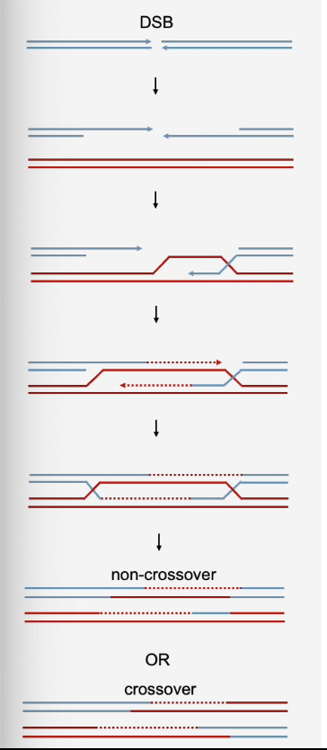

# BIO2B: Genetics and Evolution

## Recombination
After replication genes can go through two pathways - recombination and non-recombination.

Gene recombination only occurs when chromosomes are within a range of RF (physical distance between genes). This applies for both genes close together or far apart:
* Genes close together would need a crossover point between the two genes, which has a very small range
* Genes far apart would have a wider range where the crossover point can be

If the recombination frequency (**RF**) is <50%, the genes are **linked**.

Else, they aren't.

50% recombination is characteristic of non-linked segregation of alleles. a^2 + 2ab + b^2, only 2ab is recombinant.

## Homologous Recombination
Gene stability: 
* Repairs broken replication forks and DSBs
* Accurate chromosome segregation in meiosis

Genetic diversity:
* Meiotic and mitotic recombination of different alleles
* Horizontal gene transfer in bacteria

### Repairing DSBs
1. Helicases and 5'->3' nucleases work together to degrade 5' ends to make 3' overhangs
2. Strand invasion: one of the 3' overhangs invades into the homologous donor sequence
3. Repair synthesis: DNA polymerase extends the broken strand by copying the sequence across the broken region. The other broken end pairs with donor DNA
4. Double Holliday juction: the broken sequence is restored but the donor and recipient are still connected
5. HJ resolution: **HJ resolvates** resolve the junction, resulting in either non-crossover or a crossover recombination

**HR recombinase Rad51**: polymerises into a filament in single stranded DNA and is responsible for finding the homology and invading the strand.

Then, it's removed from the region so synthesis can occur.

BRCA2 is used to localize Rad51 onto DNA, and in cells lacking it, the Rad51 cannot bind onto the DNA, which destabilizes the genome.

### Holliday Junction Resolution
The symbols work like train tracks - horizontal = no change; vertical = change strands.

DSBs are generated in meiosis on purpose, and they are generated by the **Spo11** endonuclease. The broken chromosomes are forced to find homologues as they need to repair themselves.

Centromere and Non-Centromere Cohesin: Only difference is them holding different things together.

Separase separates cohesein.

## Recombination (pt 2)
Types: Needs:
1. Homologous: Extended homology
2. Site specific: Limited homology
3. Illegitimate: No homology
4. Transposition: No Homology

Separase separates cohesein.
Homology: similarity in DNA sequence

### Illegitimate (HIV)
1. GP120 -> CD4
2. Reverse transcription of ssRNA
3. cDNA -> nucleus
4. Transcription and translation of HIV DNA

Integrase operation:
1. Viral DNA cleaved to make 5' overhangs on both sides
2. Integrase cleaves host DNA, ligated to viral strands and leaves 2 small gaps
3. Gaps repaired by host DNA

### Site Specific
Lambda phage - lytic and lysogenic cycle

Phage has specific site **attP** and E.coli have **attB** (attach phage/bacteria).

Enzyme splits each DNA strand in half and binds the opposite ends to each other.

