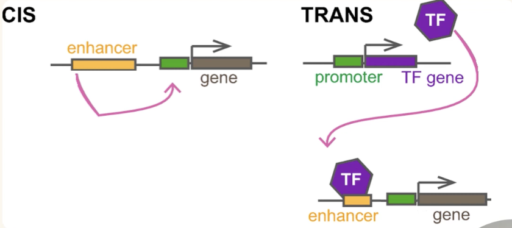
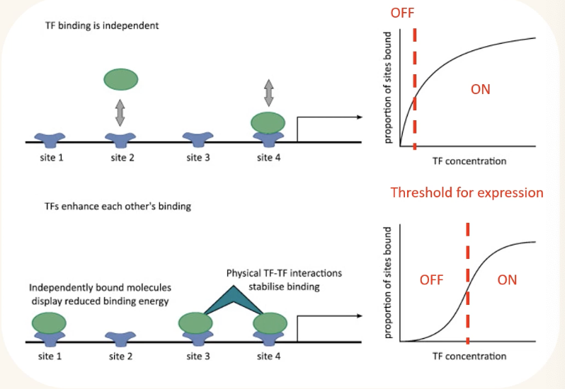
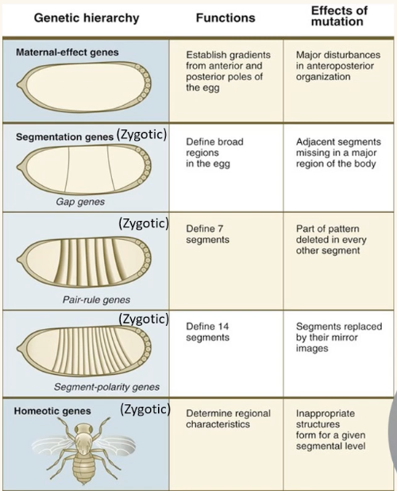
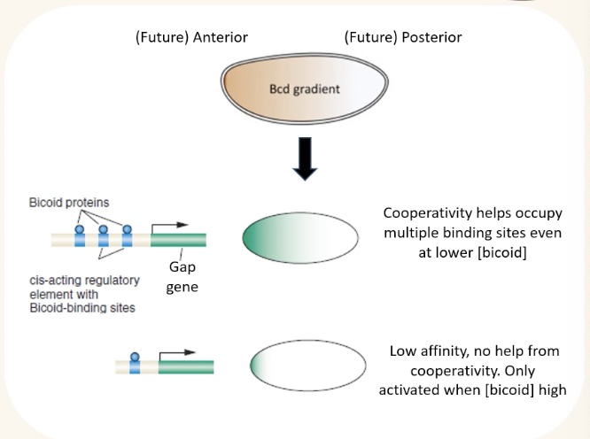

# BIO2B: Genetics and Evolution 
### Week 5

Most complex traits are continuous in nature but not all continuous traits are complex.

Continuous: character/feature that exhibits a wide range of possible values along a continuum (e.g height, eye colour, etc)

QTL (Quantitative Trait Locus): DNA associated with a particular quantitative trait. Contain/linked to genes that contribute to the variations seen in a quantitative trait. Typically polygenic.

Additive effects = curse of agony + impending doom + battle rage

SNP (Single Nucleotide Polymorphism): Genetic variation that occurs at a single nucleotide. 

APOE (Apoliprotein E): A gene that codes for protein involved in fat metabolism. e4 variant puts person at higher risk of developing Alzheimer's.

Linkage Disequilibrium: Frequency of association of alleles at 2 or more loci does not correspond to what would be expected if the loci were segregating independently during meiosis.

## Life Cycle of a Gene
### Horizontal gene transfer

Can occur through uptake from environment, transfer from bacteria, and injection by viruses.

Mitochondria and chloroplasts only have 1% and 2% of their original genome.

### Duplication
Autopolyploidisation: duplication by aneuploidy

### Hybridization
Sexual reproductionish but between different species to produce viable offspring. New genome emerges as a result.

### Whole chromosome duplication
Extra chromosomes.

### Replication error
Expansion and boom boom extra gene and everything in between.

### Unequal crossover
Lined up improperly, swapped weird

### Retrotransposition
Transcribed into RNA -> remade into DNA -> integrated into genome

A sequence needs an ORF (Open Reading Frame) and transcribed by RNA polymerase II to become a gene.

## What happens to genes
|Loss|Preservation|
|-|-|
|Deletion|Compensation|
|Genetic drift|Neofunctionalization|
|Selection against|Subfunctionalism|
|Loss of function via mutation (pseudogenization)|Lack of selection against|

Compensation: one copy is silent, regulated so levels of expression stay stable

Neofunctionalism: new function gained from a gene

Preservation: Temporal/specialization - different copies expressed in different cases

**Transposable elements (TEs)**:
* Class 1 - DNA -> RNA -> Integration
* Class 2 - DNA -> DNA excised -> Integration

Occasionally the original gene is also taken in Class 1 TE and the introns are removed. Called a retrocopy.

RNA can be changed into mRNA by removing introns and adding an adenine tail??? But usually the genes still work.

Psuedogenes lose the ability to replicate and isn't passed on.
45% of human genome are TEs

## Genes 
Hox gene: genes that code for the location of cells
Gap gene: large chunk of genes missing, 'gap' between genes
Pair rule gene: 
Maternal effect gene: 
Segment polarity gene: 

### Homeotic (Hox) mutants
* Normal body parts replaced by well-developed other part. Legs for eyebrows.
* Different situations depending on impact of mutation (loss/gain of function)
* Gain of function if expression where gene is not normally expressed

The order of the genes maps to the order of the body parts. Like HSBC tower. 

The next gene may be responsible for suppressing the previous.

Ubx is involved in repression of genes, so insects have 6 legs but other arthropods have more.

## Evo Devo
Evolutionary developmental biology: why a phenotype might exist in a population due to selection processes (evolution) and how a phenotype comes about in the individual via genetic and environmental processes (development)

Regulation of gene expression in 3D space over time. Cis-acting elements proximal to the gene, and trans-acting elements encoded by distal DNA regions. activators/repressors.

Often a gene has multiple cis elements. They act independently, and the more TFs (transcription factors) are bound to the cis elements, the easier it is for the gene to be expressed. Sharp boundary of gene expression.

Different cis elements, however may act against each other and only specific combinations will induce gene expression.

## Cell signalling
Not just cis or trans-acting regulatory elements

Encodes for cell-cell signalling pathways

Ligands released by one cell diffuse and bind to receptors in other cells

Signal transduction cascade in receiving cell, output often change in gene expression due to activation of TFs.

## Fruit fly
Christine Nusslein Volhard and Eric Wieschaus

Anterior-posterior axis development:
* Step-by-step process
* Genes encode TFs or signalling components
* Domain of expression gets progressively more restricted
* Maternal-effect genes vs zygotic genes

### Bicoid is one of the most important maternal effect genes in Drosophila
Diffuses from anterior to posterior and creates a diffusion gradient.

Binds to enhancers of zygotic target gap genes (e.g hunchback)

Each gap gene contains cis elements with different arrangements of binding sites and affinities for bicoid. 

Expressed in unique domain in response to specific bicoid levels - positional information.

### Pair rule and segment polarity genes
Pair rule genes expressed in 7 stripes - non-periodic information -> periodic patterns.

Achieved via cis-factors (cis is same jic) -> distinct enhancers control by different inputs.

## Homeotic genes
Determines identity of repeated body units

8 Hox genes, clustered in 2 gene complexes

Arrangement suggests local duplication origin

Order in the complexes corresponds to order of body regions influenced by each Hox gene

Spatially restricted.

Genetic Toolkit of development - set of genes controlling identity/formation/number of body parts and organization of the primary body axes.

Like different embryos looking very similar

## Evo
Cis element evolution - can result in gain/loss of traits

Co-option - use of preexisting gene for new function (e.g regulation of yellow due to changes in cis-elements)

## Trans element
Changes TF expression or binding ability

Addition or alteration of amino acid motifs that can then interact with new proteins

Pre-existing function retained, new function added

### Dev constraints
* Not all phenotypes are expressed in nature (angels)
* Multiple causes - lack of variation in genetic factors, strong correlation between traits
* TFs binding to multiple genes produces pleiotropy
* Constraints can limit evolvability

Pleitropy - gene affects >=2 characters

