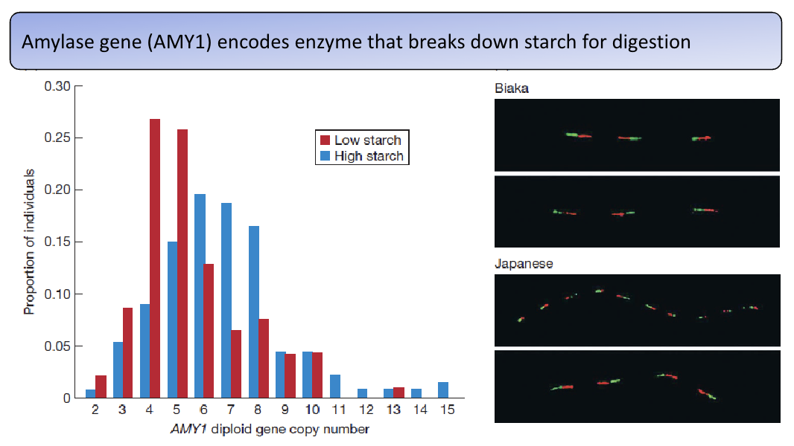

# BIO2B Genetics and Evolution

## Adaptations
Adaptation: a trait currently favoured by natural selection, and previously shaped by natural selection.

NS requires that: 
* There's variation amongst individuals
* Some of that is inheritable
* Variation effects survival and reproduction (fitness)

### Variation effects fitness
Clear traits:
* No. offspring
* Camouflage (isn't that bad camouflage)
* Toxins (Dendrobates)

More difficult to quantize:
* Face colouring
* Time of flowering
* Mimicry

