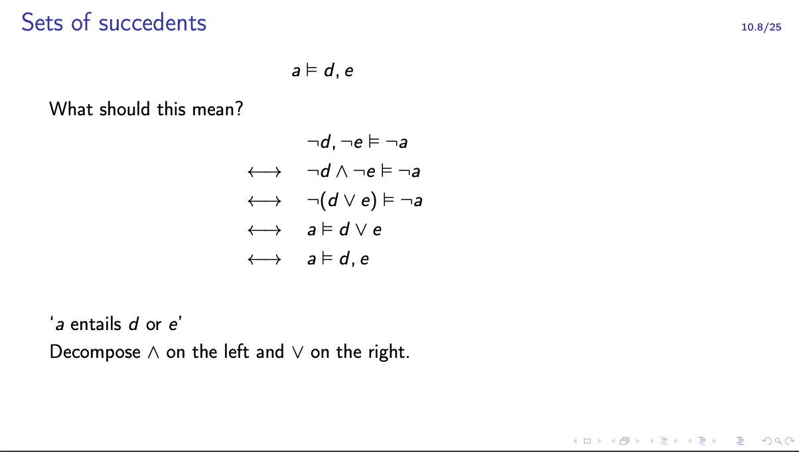
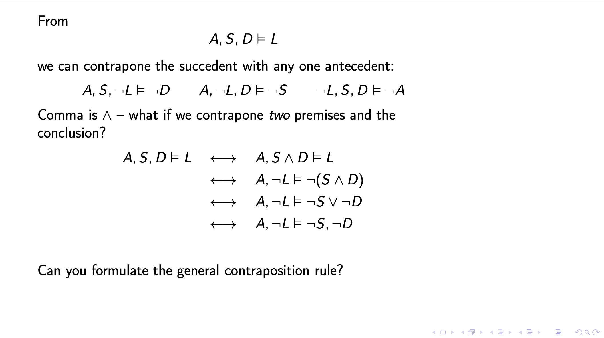

# INF1A: Introduction to Computation
### Julian Bra D. Field

## Operations on predicates
* (not a) x = not a (x)
* (a or b)(x) = a(x) or b(x)
* (a and b)(x) = a(x) and b(x)

Duality: and -> or when negated and moved around ish

No reason you can't:

a, b, c |= d, e, f

Comma left = and, comma right = or

So if all a, b, c; then one of d, e, f is true.

gamma is used to represent a list of assumptions, and looks like 「.

『, a |= b means everything in g and a entails b

Essentially, a|=b is true for everywhere that 「 holds true.

One can break everything down and compartmentalize the manipulations with commas.

